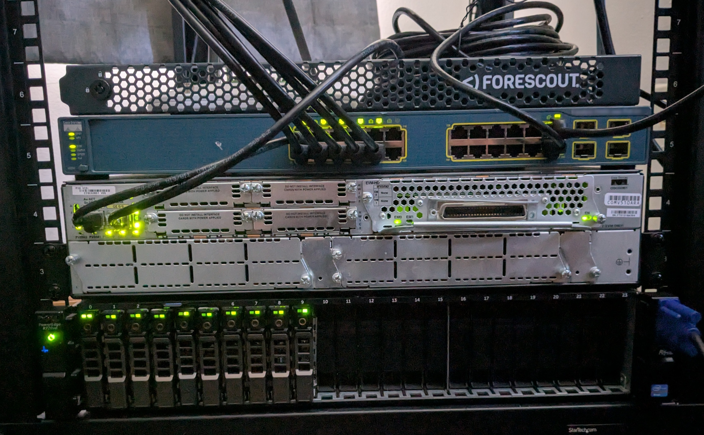

# CorpoSec Network
*Corporate style home network & cyber range*

---

## Background
I started my home network while at university with a Raspberry Pi. As I learned more about networking, I expanded with a Cisco router and switch. I eventually bought a server to host more applications and spin up VMs. This project went under a full redesign to more closely mimic a corporate network, including a SOC.

---

## Current State
- Network is up and running with VLANs, though I still need to implement proper ACLs.  
- Server is fully operational, including iDRAC, and supports spinning up and SSH access to VMs.  

I am focusing on getting applications up and running.  

---

## Documentation
- [Network Architecture](/docs/Network-Architecture.md) – Details network design and topology  
- [Server Setup](/docs/Server-Setup.md) – Installation steps, config, and deployment notes  
- [Services](/docs/Services.md) – Overview of applications hosted on the server  

**Resources**  
- `/docs/`  
- `/assets/`  

---

## Hardware
- Dell PowerEdge R720xd (ESXi on a Crucial BX500 SATA SSD)  
- Cisco Router  
- Cisco Switch  
- Cisco Access Point  
- Raspberry Pi 5  

**Rack**  
- StarTech 4-post 12U mobile open frame  
- 1U 19 inch Server Rack Rails (2)  
- 16 Outlet Horizontal 1U Rack Mount PDU  

