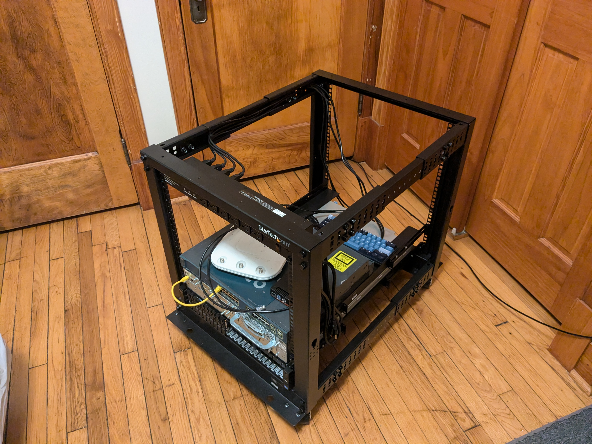
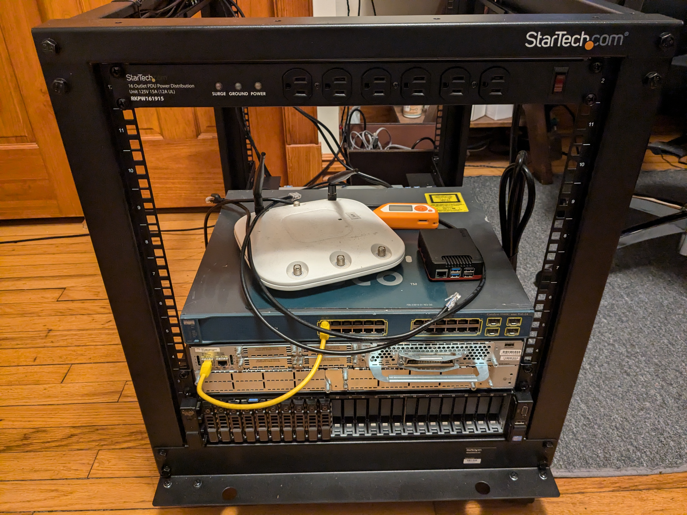
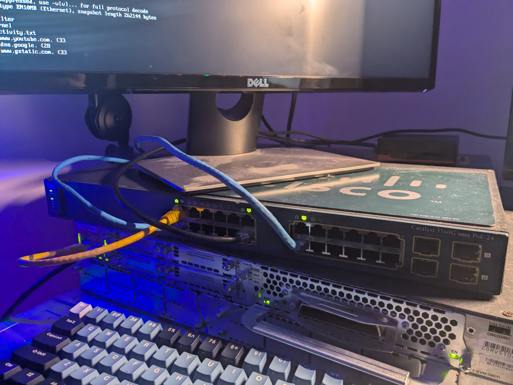

# HomeNetwork

# Background
I initially bought a pi to run Pi-Hole when I lived on campus at my University, I wanted to run a lite OS but couldn't figure out how to connect it to the wifi without a GUI. Glancing over at my cisco stuff I started this project. I bought the server later to spin up VMs for a cyber range, and help my peers prepare for CCDC but I ran into trouble using ansible.

The current state of this project:
- Network is up and running with VLANS, I still need to implement proper ACLs so the VLANS actually do something.
- Server is up and running as well, including iDRAC and such, and there are VMs you can spin up and SSH into, just not much else.
- Raspberry Pi is no longer working, I stole the SSD to use in my laptop, but I had PiHole, tailscale, and was working on setting up a password manager among other things to de-google myself.

---

## Equiptment
  - Dell Poweredge R720xd (enterprise drives)   # Currently running ESXi
  - Cisco 2851 Router
  - Cisco Catalyst 3560G Switch
  - Raspberry Pi 5
### Rack
  - StarTech 4-post 12U mobile open frame
  - 1U 19 inch Server Rack Rails (2)
  - 16 Outlet Horizontal 1U Rack Mount PDU
  
---

Topology

Switch config

---

Here is my rack setup

